# Process Data Dashboard

A Shiny app to load raw process data, perform data extraction and EDA. With the processed data, we train models to make predictions on process outcomes.

For a demo, run the Shiny app from Github repo with the codes below:

```{r}
shiny::runGitHub("Process_Data_Dashboard", "chsueh2", subdir = "UnitProcess/") 
```

Key features:

- Shiny Dashboards with Sidebar and Dynamic Tabs
- Data Extraction and Transformation
- EDA
- Cross Validation
- Multinomial Logistic Regression
- K-Nearest Neighbors (KNN)
- Random Forests

R packages used:

- `here`: enables easy file referencing and builds file paths in a OS-independent way
- `stats`: loads this before loading `tidyverse` to avoid masking some `tidyverse` functions
- `tidyverse`: includes collections of useful packages like `dplyr` (data manipulation), `tidyr` (tidying data),  `ggplots` (creating graphs), etc.
- `rlang`: collection of frameworks and APIs for programming with R including non-standard evaluation
- `readxl`: read excel files
- `lubridate`: handle date and datetime data type
- `hms`: functions to deal with time
- `glue`: offers interpreted string literals for easy creation of dynamic messages and labels
- `scales`: formats and labels scales nicely for better visualization
- `caret`: training and plotting classification and regression models
- `randomForest`: random forest algorithm for classification and regression.
- `ranger`: a fast implementation of random forests 
- `gbm`: generalized boosted regression models
- `shiny`: build interactive web applications

## Workflow

- Setup: configure options, load packages and define helper functions
- Load raw process data, filter and extract unit process data
- Data exploration and panel plots
- Modeling and prediction
  - Split training/test set
  - Train and select model with cross validation
  - Compare model performance
  - Choose a model to make prediction

Files and directories:

- `00 preloads.R`: set up and load packages
- `01 UnitProcess.R`: include helper functions to process and plot process log data
- `02 FitMode.R`: includes helper functions to fit model and plot hyperprameter
- `/data`: raw data files for demo
- `/runs`: run data for demo
- `/screenshots`: screenshots of the app
- `/UnitProcess`: Shiny app

## Screenshots

### About the app
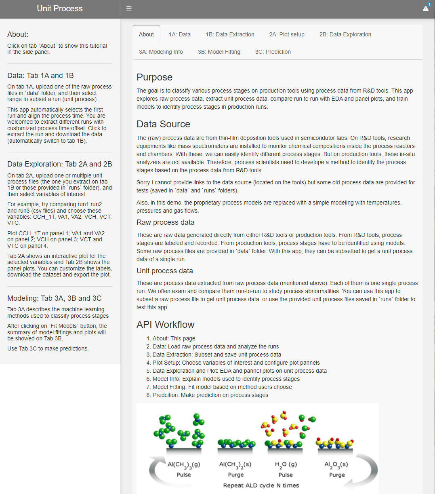

### Load Raw Data
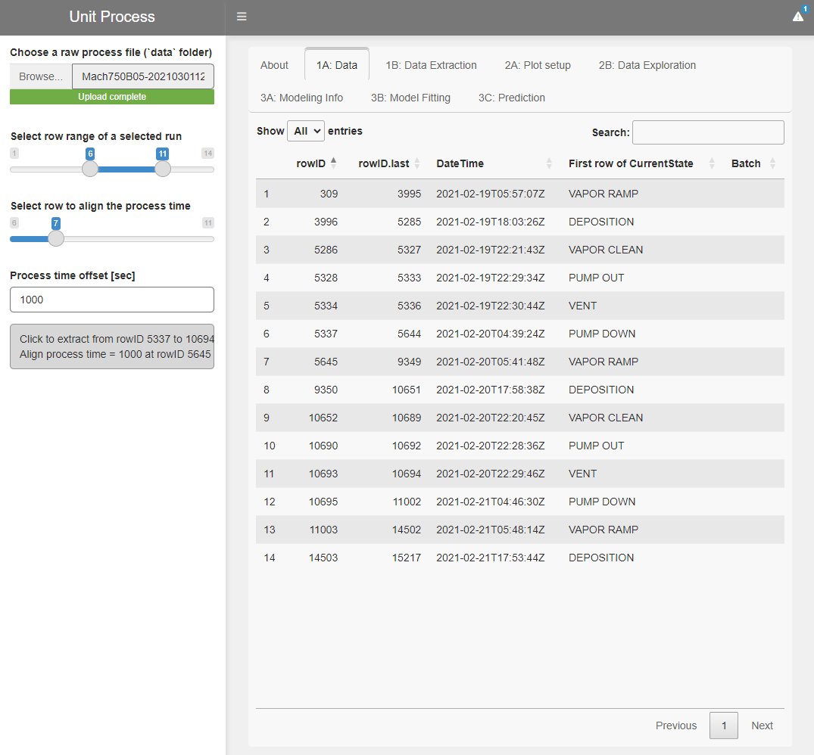

### Data Extraction
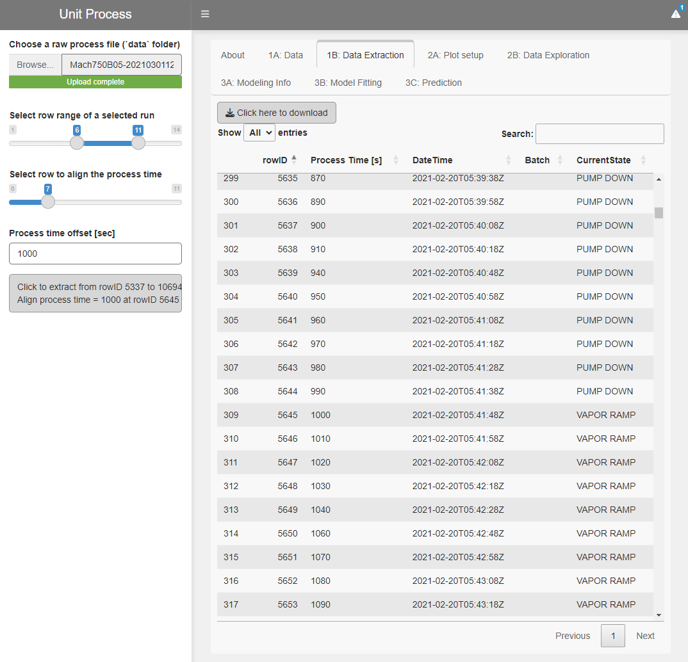

### Plot setup
Choose which variables to plot.
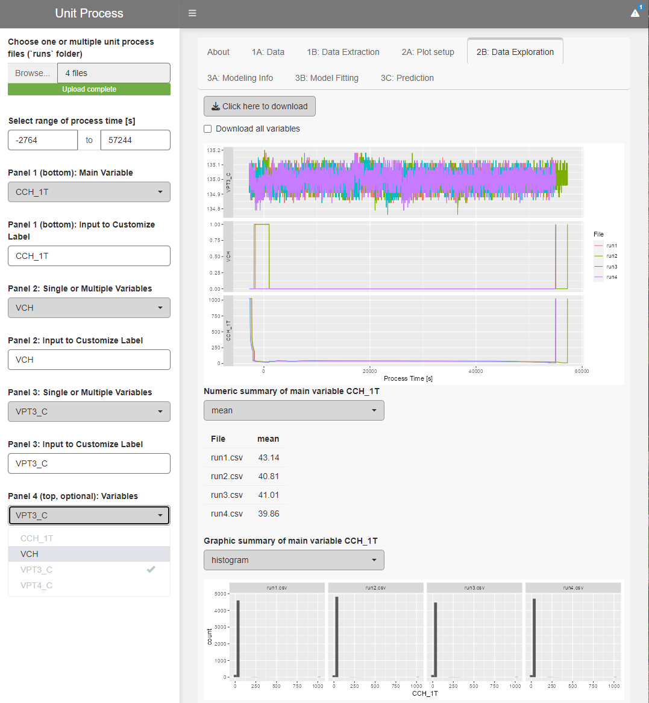)

### Data Exploration
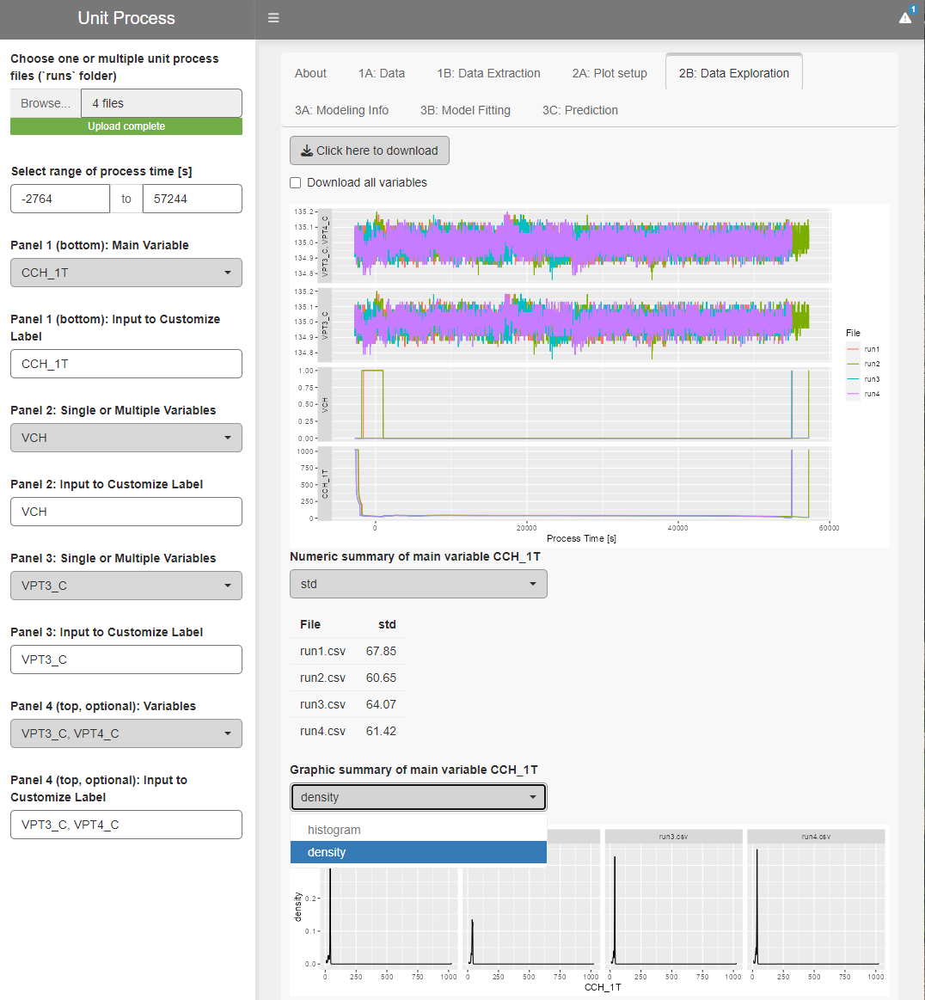

### Moldeling Algorithms
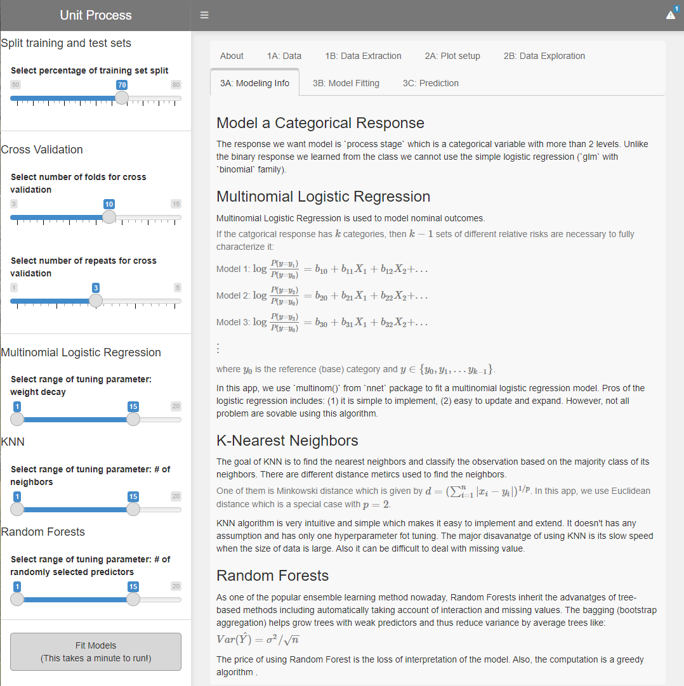

### Model Fitting (Cross Validation): Multinomial Logistic Regression
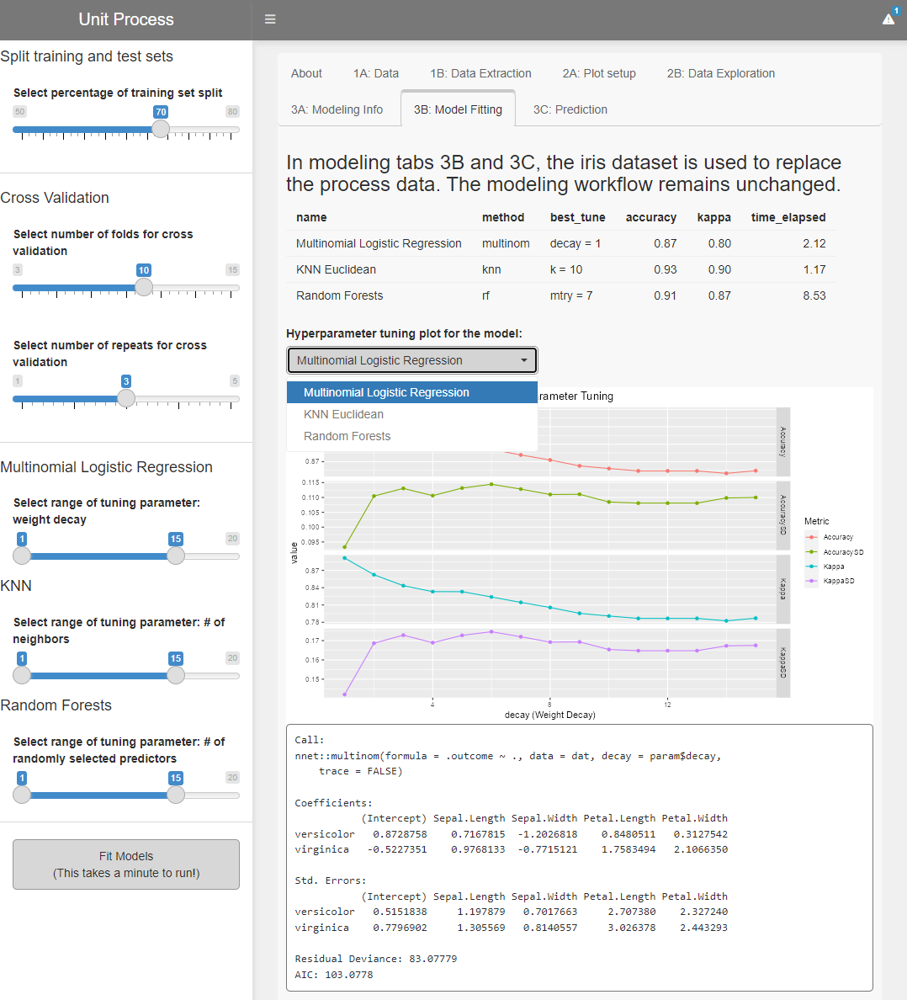

### KNN
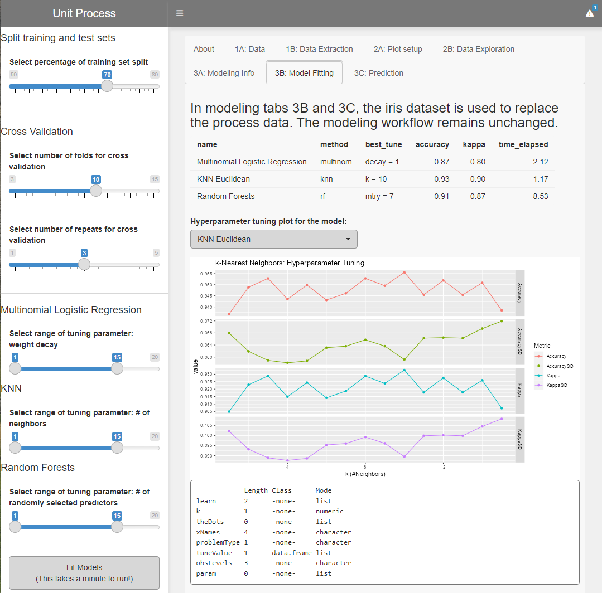

### Randon Forests
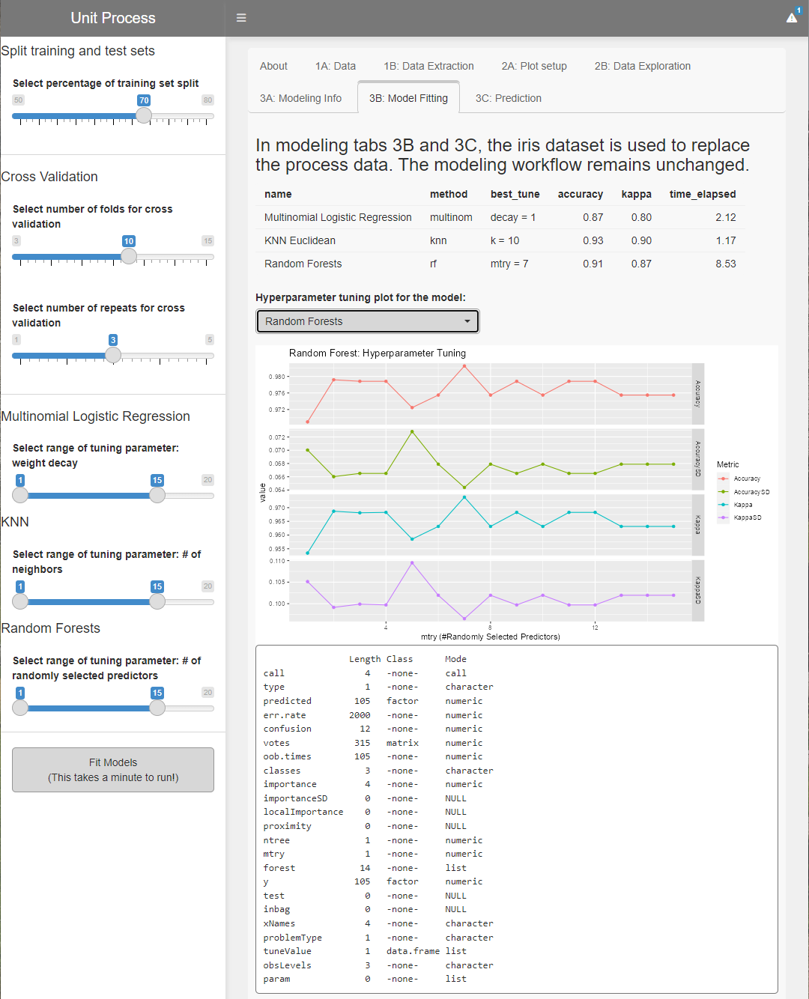

### Predictions Using Multinomial Logistic Regression Model
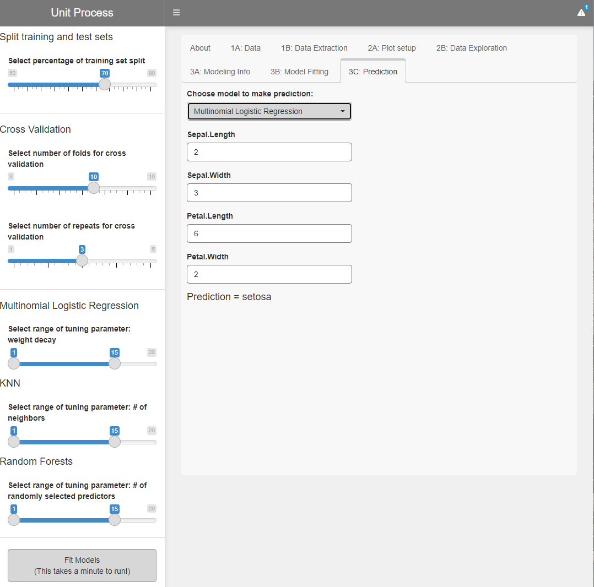

### Predictions Using KNN Model
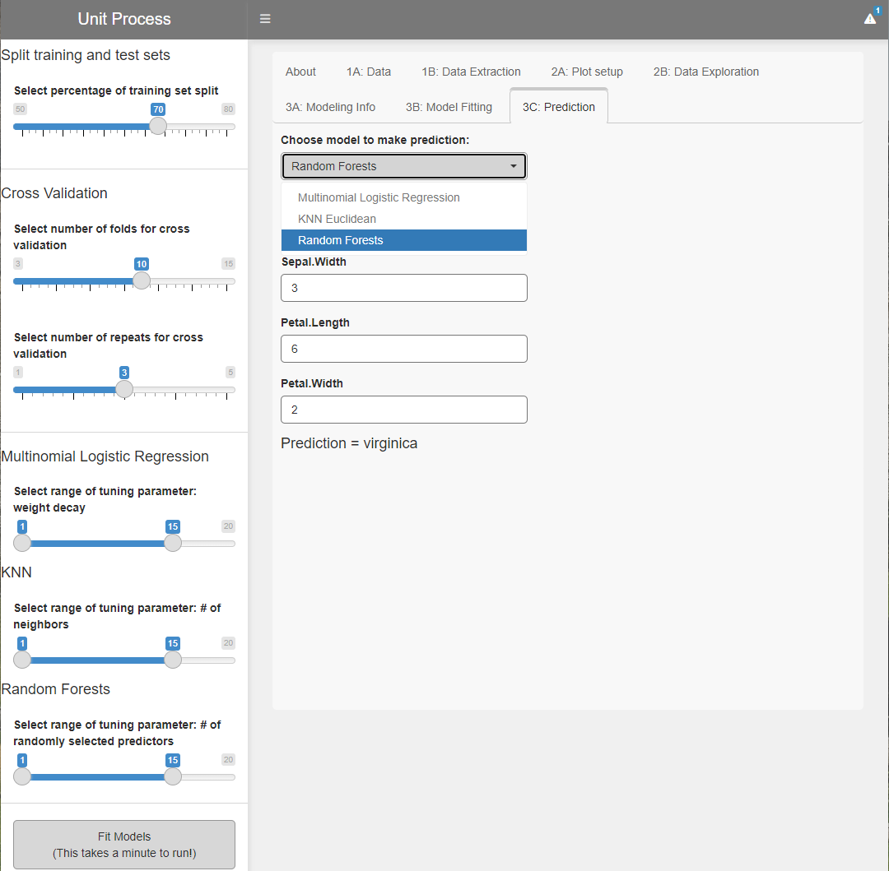

